# QwenWeaver Architecture

QwenWeaver is a TypeScript-native, pnpm monorepo that combines a visual DAG editor (React Flow v12) with a parallel execution engine (Hono.js) and Qwen AI models (DashScope) to orchestrate multi-agent workflows.

---

## 1. High-Level System Architecture

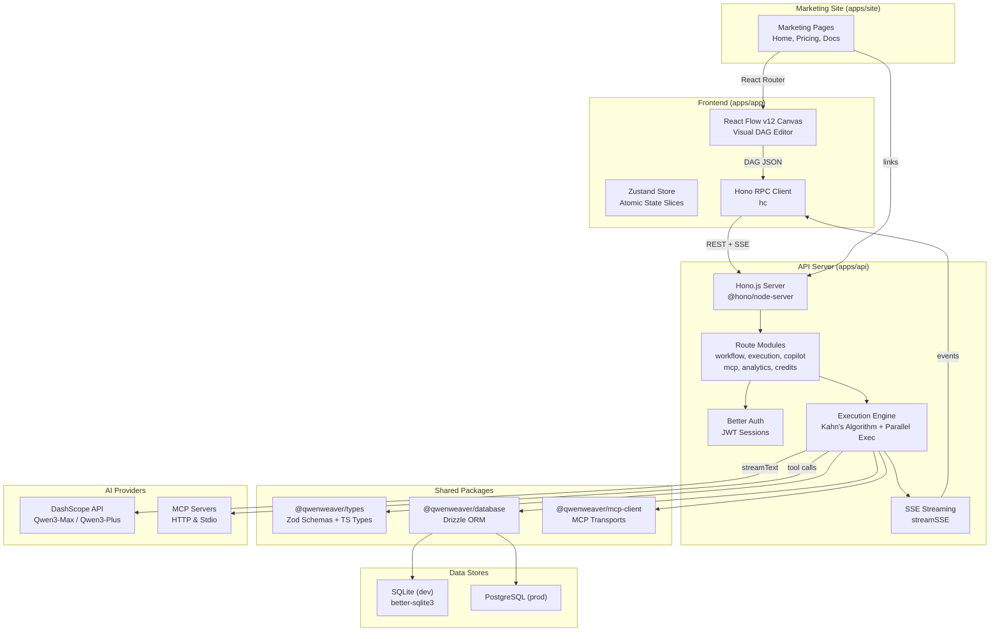

---

## 2. Frontend Architecture

### 2.1 React Flow Canvas & Zustand Store

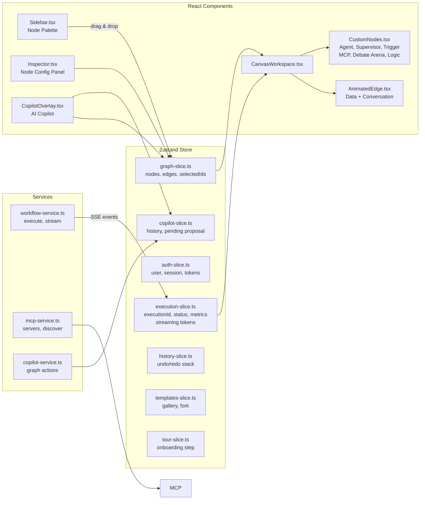

**State design principles:**

- **Granular selectors** — components subscribe to specific slices (e.g., `useStore(s => s.nodes)`) not the full store, preventing unnecessary re-renders.
- **Atomic slices** — each domain concern has its own slice file (`graph-slice.ts`, `execution-slice.ts`, etc.), composed in `store.ts`.
- **Auto-save** — graph mutations are debounced and persisted to the API via `auto-save.ts`.

### 2.2 SSE Event Handling

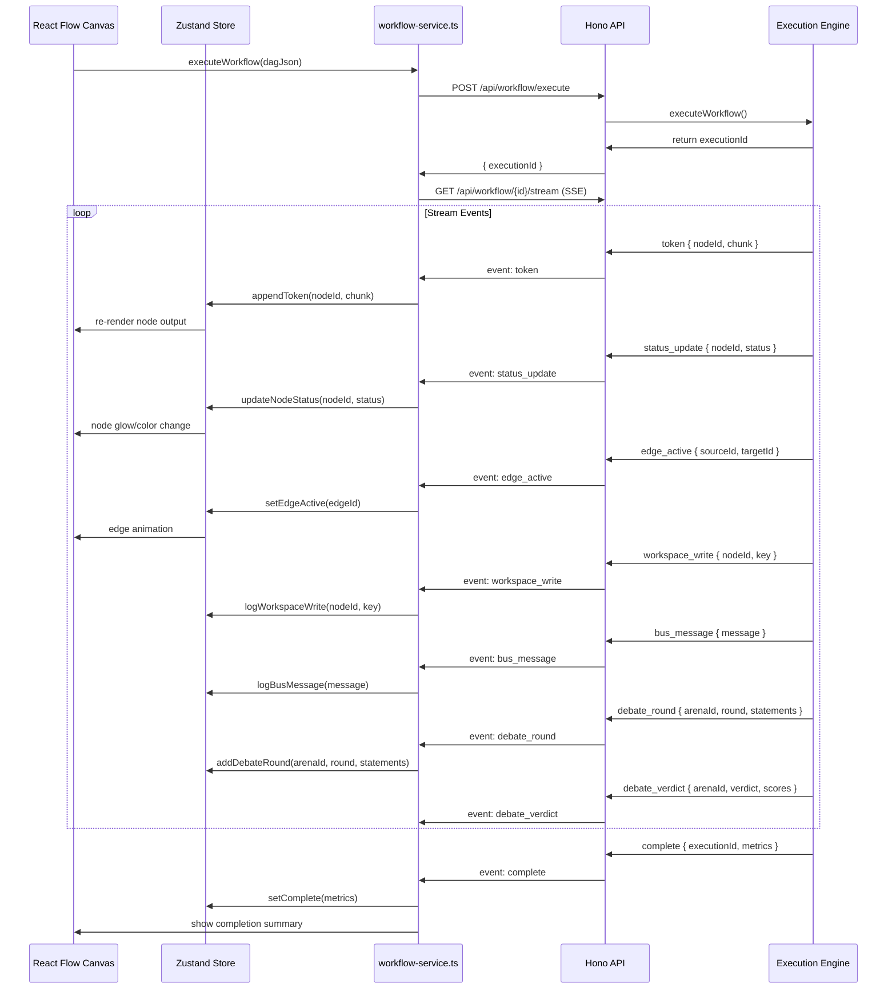

---

## 3. Backend Architecture

### 3.1 API Route Modules

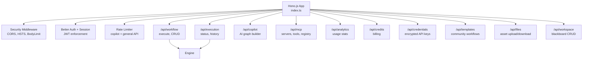

### 3.2 Execution Engine

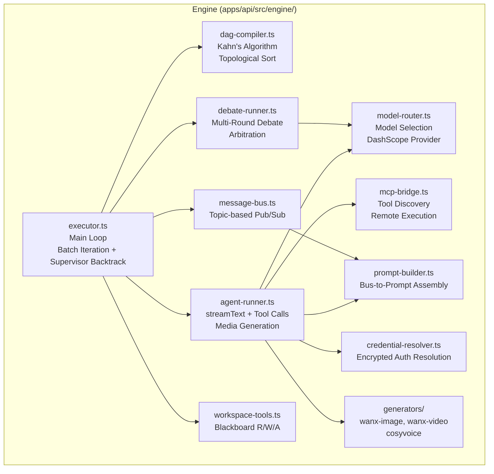

### 3.3 DAG Compilation (Kahn's Algorithm)

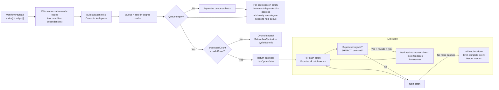

### 3.4 Inter-Agent Communication (DataBus)

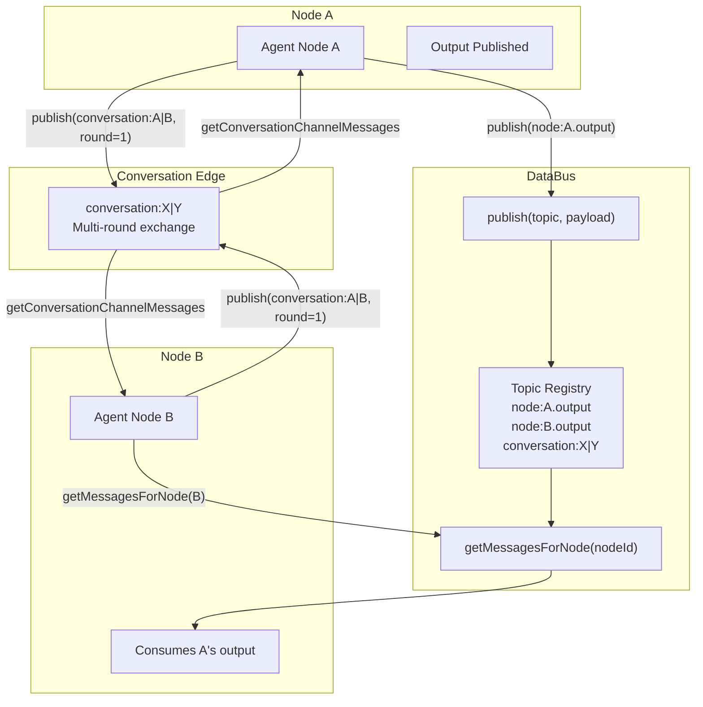

The DataBus (`message-bus.ts`) is a topic-based pub/sub system:

| Topic Pattern              | Description                                                         |
| -------------------------- | ------------------------------------------------------------------- |
| `node:{nodeId}.output`     | Default subscription — downstream agents consume via incoming edges |
| `node:{nodeId}.error`      | Error notifications                                                 |
| `conversation:{channelId}` | Multi-round conversation exchange between paired agents             |

Messages are persisted to the `execution_messages` table for audit trails when `persistLogs` is enabled.

---

## 4. Node Types

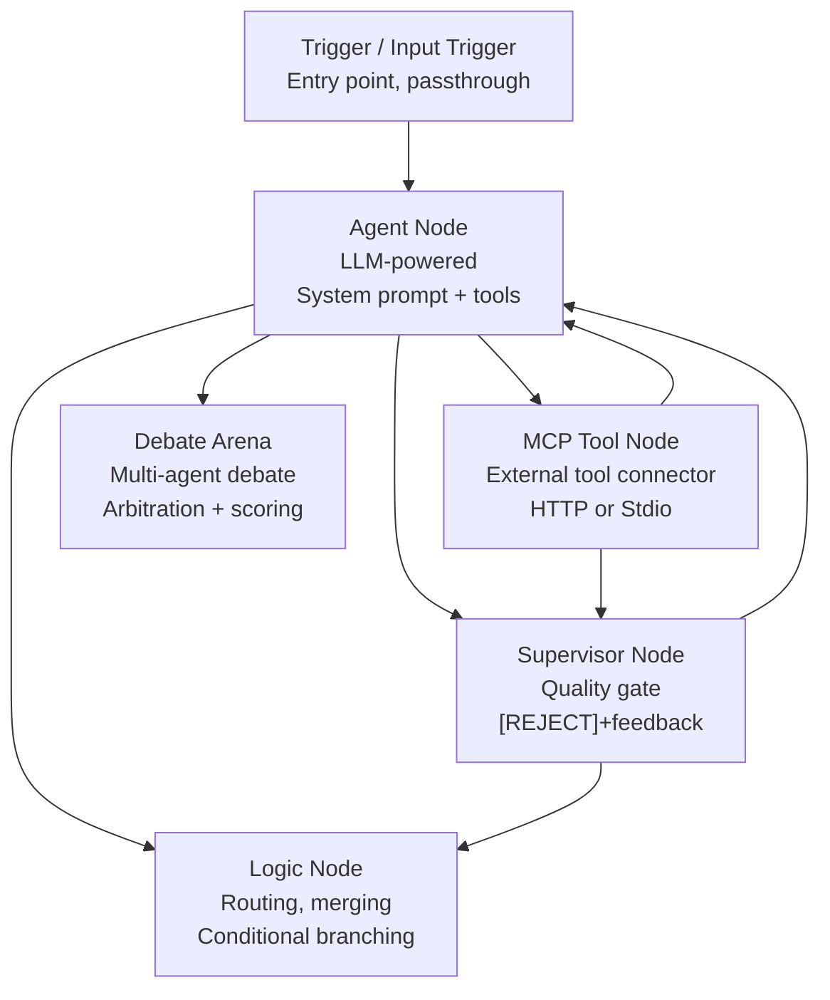

### Agent Node Configuration

| Parameter        | Description                                | Default     |
| ---------------- | ------------------------------------------ | ----------- |
| `systemPrompt`   | Defines agent behavior and role            | —           |
| `model`          | LLM model identifier                       | `qwen3-max` |
| `enableThinking` | Chain-of-thought reasoning                 | `false`     |
| `thinkingBudget` | Max tokens for reasoning                   | `4096`      |
| `outputFormat`   | Output format (markdown, html, json, etc.) | `markdown`  |
| `mcpTools`       | Attached MCP tool configurations           | —           |

### Supervisor Node Negotiation

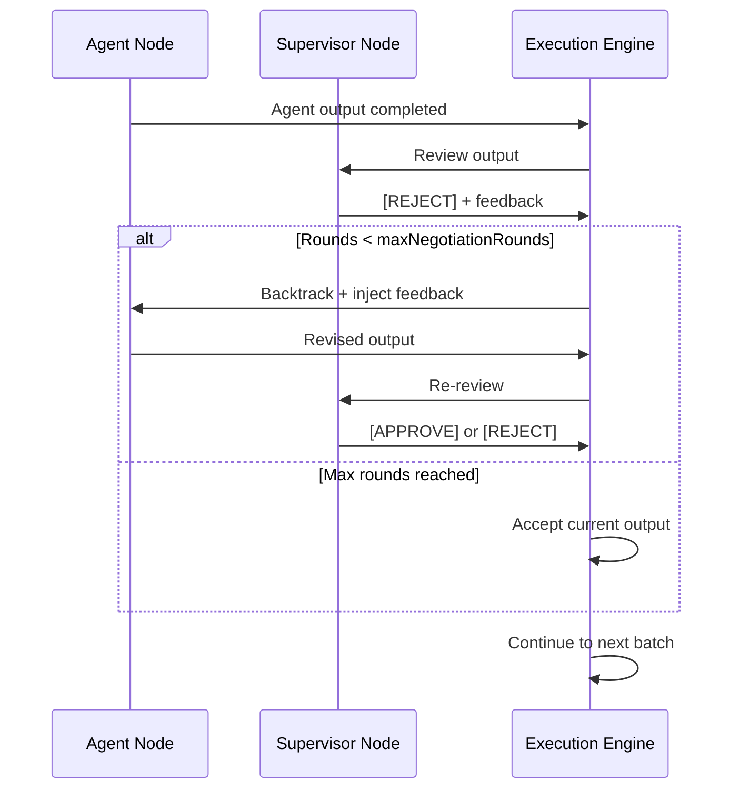

### Debate Arena Modes

| Mode          | Description                                         |
| ------------- | --------------------------------------------------- |
| `debate`      | Participants argue positions, address counterpoints |
| `negotiation` | Find common ground, propose compromises             |
| `consensus`   | Work toward unified conclusion                      |

Output formats: `verdict` (transcript + verdict + scores), `transcript` (raw transcript only), `score` (numeric scores only).

---

## 5. Database Strategy

### 5.1 Dual-Dialect Schema

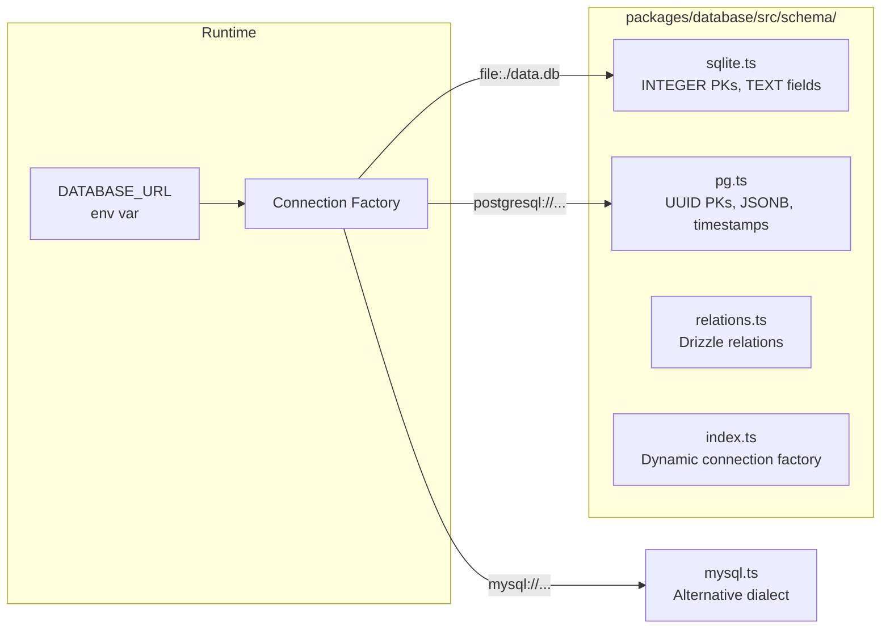

**Schema design rules:**

- **Additive only** — never drop or rename columns. Prevents breaking production.
- **Provider pattern** — `getQueryProvider()` returns the correct dialect-specific implementation.
- **Shared migrations** — Drizzle Kit generates dialect-aware SQL.

### 5.2 Key Tables

| Table                | Purpose                                            |
| -------------------- | -------------------------------------------------- |
| `users`              | Auth + profile                                     |
| `workflows`          | DAG definitions (nodes + edges JSON)               |
| `executions`         | Run state, metrics, timing                         |
| `agent_logs`         | Per-node execution logs (prompts, outputs, tokens) |
| `execution_messages` | DataBus message persistence                        |
| `workspace_entries`  | Blackboard key-value store per execution           |
| `mcp_servers`        | Registered MCP server configurations               |
| `credentials`        | Encrypted API keys and auth tokens                 |
| `credits`            | Usage billing (cloud only)                         |

---

## 6. MCP Integration

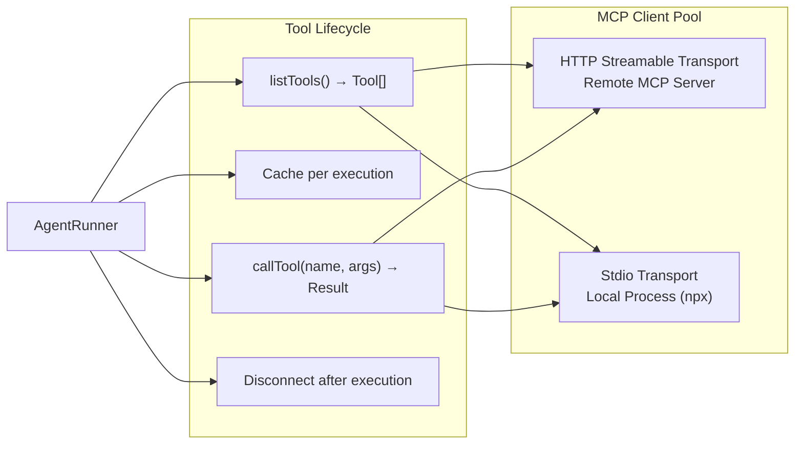

**Auth methods:** `none`, `api_key` (header), `bearer` (token), `basic` (username+password). Credentials are stored encrypted in the `credentials` table and resolved at execution time via `credential-resolver.ts`.

---

## 7. Media Generation Pipeline

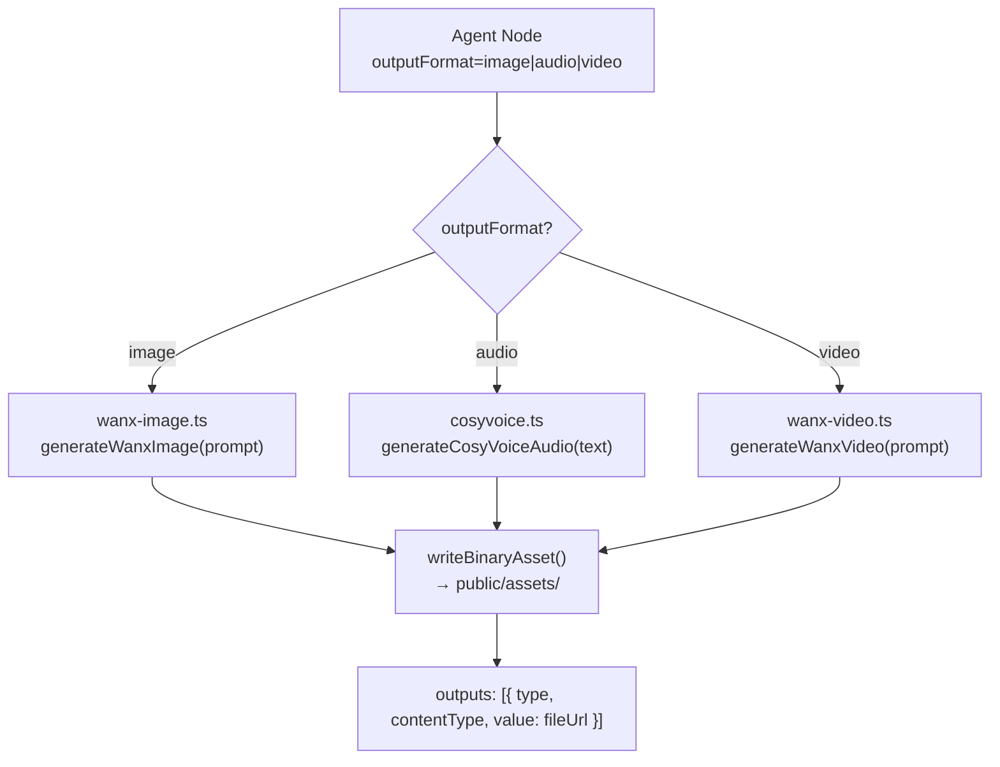

All generated assets are written to the `public/assets/` directory and served statically. The frontend renders them via `OutputRenderer.tsx` which handles `image/*`, `audio/*`, `video/*`, and `text/*` content types.

---

## 8. Workspace Blackboard

The shared workspace is a key-value store scoped to a single execution, optimized for concurrent agent access:

- **`workspace_write(key, value)`** — upsert with optimistic concurrency (version `round` field)
- **`workspace_read(key)`** — read by key
- **`workspace_list(prefix?)`** — list keys with optional prefix filter
- **`workspace_append(key, item)`** — append to array with retry-on-conflict

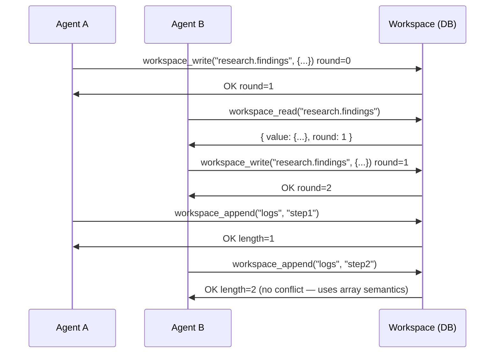

---

## 9. Prometheus Metrics

The engine exposes operational metrics at `/api/metrics` (authenticated via `METRICS_TOKEN`):

| Metric              | Type      | Labels               | Description                  |
| ------------------- | --------- | -------------------- | ---------------------------- |
| `executions_total`  | Counter   | `status`             | Total workflow executions    |
| `llm_tokens_total`  | Counter   | `model`, `node_type` | Total LLM tokens consumed    |
| `agent_duration_ms` | Histogram | `node_type`          | Per-agent execution duration |

---

## 10. Project Map

```
qwenweaver/
├── apps/
│   ├── app/                          # Main SPA (React 19 + Vite + React Flow v12)
│   │   └── src/
│   │       ├── store/                # Zustand atomic slices
│   │       ├── components/           # React Flow nodes, edges, panels
│   │       ├── services/             # API service wrappers
│   │       ├── hooks/                # React hooks (shortcuts, auto-save)
│   │       ├── lib/                  # API client, templates, example workflows
│   │       ├── data/                 # Worker options, templates data
│   │       └── utils/                # DAG layout, graph actions, validation
│   │
│   ├── site/                         # Marketing site (Vite + React + Tailwind v4)
│   │   └── src/
│   │       ├── pages/                # Home, Pricing
│   │       ├── docs/                 # MDX/React documentation pages
│   │       └── components/           # Shared site components
│   │
│   └── api/                          # Hono.js backend
│       └── src/
│           ├── engine/               # Core execution engine
│           │   ├── dag-compiler.ts    # Kahn's Algorithm
│           │   ├── executor.ts        # Main execution loop
│           │   ├── agent-runner.ts    # LLM agent execution
│           │   ├── debate-runner.ts   # Multi-agent debate
│           │   ├── message-bus.ts     # Inter-agent pub/sub
│           │   ├── mcp-bridge.ts      # MCP tool discovery/calling
│           │   ├── model-router.ts    # Model selection + provider
│           │   ├── prompt-builder.ts  # Prompt assembly from bus messages
│           │   ├── workspace-tools.ts # Blackboard tools
│           │   ├── credential-resolver.ts
│           │   ├── file-asset.ts      # Binary asset storage
│           │   └── generators/        # Media generation (Wanx, CosyVoice)
│           ├── routes/               # API route modules
│           ├── middleware/           # Rate limiter
│           ├── auth.ts               # Better Auth integration
│           ├── logger.ts             # Pino structured logging
│           ├── metrics.ts            # Prometheus metrics
│           └── config.ts             # Environment configuration
│
├── packages/
│   ├── types/                        # Shared Zod schemas + TypeScript
│   │   └── src/
│   │       ├── graph.ts              # Node/Edge/Execution schemas
│   │       └── mcp.ts                # MCP tool definitions
│   │
│   ├── database/                     # Drizzle ORM dual-dialect
│   │   └── src/
│   │       └── schema/               # sqlite.ts, pg.ts, mysql.ts, relations.ts
│   │
│   └── mcp-client/                   # MCP transport layer
│       └── src/
│           └── index.ts              # HTTP & Stdio clients
└── ...config files
```
