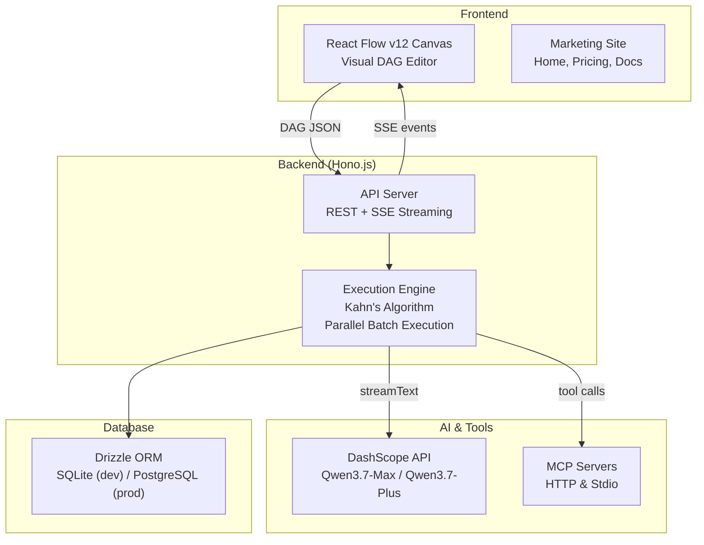

# QwenWeaver

<p align="center">
  
  
  
  
  
</p>

<p align="center">
  <strong>Visual multi-agent orchestration platform</strong><br />
  <em>Build, connect, and run AI agent workflows — visually.</em>
</p>

## Overview

QwenWeaver is a TypeScript-native platform for designing and executing multi-agent AI workflows. Arrange agents as a directed acyclic graph (DAG) on a visual canvas, connect them with edges to define data flow, and execute the entire pipeline with automatic parallelization, real-time SSE streaming, and intelligent conflict resolution.

Built for the Qwen Cloud Hackathon Track 3 ("Agent Society").

## Features

- **Visual DAG Canvas** — drag-and-drop workflow editor powered by React Flow v12. Pan, zoom, connect nodes, and inspect outputs in real time.
- **Parallel Execution Engine** — Kahn's Algorithm compiles the DAG into topological batches. Zero-in-degree nodes within each batch run concurrently via `Promise.all`, maximizing throughput.
- **Real-Time SSE Streaming** — every execution streams `token`, `thinking`, `status_update`, `edge_active`, `workspace_write`, `bus_message`, `debate_round`, and `complete` events to the canvas. Nodes glow, edges animate, and output appears token-by-token.
- **Supervisor Nodes** — quality gate agents that review outputs and can reject them with revision feedback. Supports multi-round backtracking with configurable negotiation limits.
- **Debate Arena Nodes** — multi-agent debate with configurable modes (debate, negotiation, consensus). Supports multiple rounds, optional AI arbitrator with scoring.
- **Conversation-Mode Edges** — enable multi-round back-and-forth exchanges between agents on connected edges, simulating natural conversation.
- **Shared Workspace Blackboard** — agents can read/write/append to a shared key-value workspace with optimistic concurrency control, enabling collaborative data sharing.
- **Inter-Agent Message Bus** — topic-based pub/sub DataBus for structured communication between agents. Messages are persisted to DB for audit trails.
- **MCP Tool Integration** — connect any Model Context Protocol server (HTTP Streamable or Stdio) as a node. Tools are automatically discovered and injected into agent prompts.
- **AI Media Generation** — built-in support for image generation (Wanx), audio synthesis (CosyVoice), and video generation (Wanx Video) via Qwen DashScope API.
- **Multi-Output Formats** — agents can output markdown, HTML, JSON, CSV, XML, YAML, plain text, images, audio, or video.
- **AI Copilot** — natural-language workflow builder embedded in the canvas. Describe what you want and the copilot generates or modifies the graph.
- **Template Library** — community workflow templates with fork support. Publish and discover reusable workflows.

## Architecture



The frontend canvas serializes the workflow DAG as JSON and sends it to the API. The backend compiles the graph into topological batches using Kahn's Algorithm and executes independent agents concurrently. Results stream back in real time via Server-Sent Events, with tokens, status updates, and edge activations animating on the canvas.

See [ARCHITECTURE.md](./ARCHITECTURE.md) for the full architecture documentation.

## Prerequisites

- **Node.js** >= 20
- **pnpm** >= 9

## Getting Started

```bash
# Install dependencies
pnpm install

# Start development servers (app + site + api concurrently)
pnpm dev

# App:  http://localhost:5173
# Site: http://localhost:5174
# API:  http://localhost:3001
# Docs: http://localhost:3001/api/docs
```

## Available Commands

| Action              | Command          |
| ------------------- | ---------------- |
| Start dev servers   | `pnpm dev`       |
| Build all packages  | `pnpm build`     |
| Run tests           | `pnpm test`      |
| Lint                | `pnpm lint`      |
| Type-check          | `pnpm typecheck` |
| DB migrations (dev) | `pnpm db:push`   |

## Tech Stack

| Layer        | Technology                                                        |
| ------------ | ----------------------------------------------------------------- |
| **Frontend** | React 19, Vite 8, React Flow v12, Zustand, Tailwind v4, shadcn/ui |
| **Backend**  | Hono.js 4, `@hono/node-server`, SSE streaming                     |
| **Database** | Drizzle ORM, better-sqlite3 (dev) / postgres (prod)               |
| **AI**       | `@ai-sdk/alibaba` — Qwen3.7-Max / Qwen3.7-Plus on DashScope       |
| **MCP**      | `@modelcontextprotocol/sdk` — HTTP & Stdio transports             |
| **Auth**     | Better Auth — JWT sessions, email/password, OAuth                 |

## License

[MIT](LICENSE)
