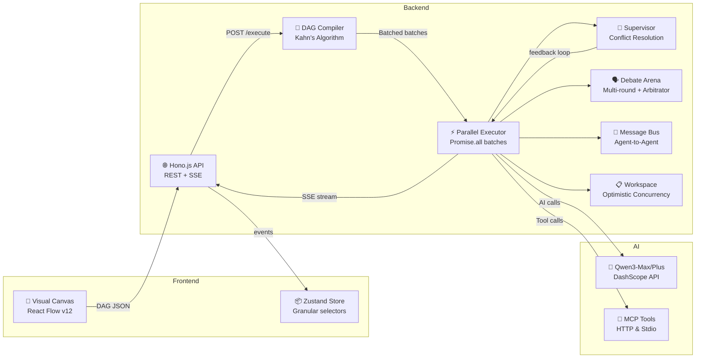

# QwenWeaver

<p align="center">
  
  
  
  
  
</p>

<p align="center">
  <strong>Visual multi-agent orchestration platform</strong><br />
  <em>Build, connect, and run AI agent workflows — visually.</em>
</p>

## Overview

QwenWeaver is a TypeScript-native platform for designing and executing multi-agent workflows. Arrange agents as a directed acyclic graph (DAG) on a canvas, connect them with edges, and run the entire pipeline with parallel execution, SSE streaming, and conflict resolution via supervisor nodes.

Built for the Qwen Cloud Hackathon Track 3 ("Agent Society").

## Architecture

```
qwenweaver/
├── apps/
│   ├── app/          React 19 + Vite + React Flow v12 + Zustand + Tailwind
│   ├── site/         Marketing site — Vite + React + Tailwind v4
│   └── api/          Hono.js backend — SSE streaming, DAG execution, MCP tools
├── packages/
│   ├── types/        Shared Zod schemas & TypeScript interfaces
│   ├── database/     Drizzle ORM — dual dialect (SQLite / PostgreSQL)
│   └── mcp-client/   Model Context Protocol transport (HTTP & Stdio)
```



## Prerequisites

- **Node.js** >= 20
- **pnpm** >= 9

## Getting Started

```bash
# Install dependencies
pnpm install

# Start development servers (app + site + api concurrently)
pnpm dev

# App:  http://localhost:5173
# Site: http://localhost:5174
# API:  http://localhost:3001
# Docs: http://localhost:3001/api/docs
```

## Available Commands

| Action              | Command          |
| ------------------- | ---------------- |
| Start dev servers   | `pnpm dev`       |
| Build all packages  | `pnpm build`     |
| Run tests           | `pnpm test`      |
| Lint                | `pnpm lint`      |
| Type-check          | `pnpm typecheck` |
| DB migrations (dev) | `pnpm db:push`   |

## Key Features

- **Visual canvas** — drag-and-drop DAG editor powered by React Flow v12
- **Parallel execution** — zero-in-degree nodes run concurrently via `Promise.all`
- **SSE streaming** — real-time `token`, `status_update`, `edge_active`, `complete` events
- **Supervisor nodes** — resolve conflicting outputs using `qwen3-max` with chain-of-thought
- **MCP tool integration** — connect any Model Context Protocol server as a node
- **Dual-database** — SQLite for local development, PostgreSQL for production

## Tech Stack

| Layer        | Technology                                                        |
| ------------ | ----------------------------------------------------------------- |
| **Frontend** | React 19, Vite 8, React Flow v12, Zustand, Tailwind v4, shadcn/ui |
| **Backend**  | Hono.js 4, `@hono/node-server`, SSE streaming                     |
| **Database** | Drizzle ORM, better-sqlite3 (dev) / postgres (prod)               |
| **AI**       | `@ai-sdk/alibaba` — Qwen3-Max / Qwen3-Plus on DashScope           |
| **MCP**      | `@modelcontextprotocol/sdk` — HTTP & Stdio transports             |

## License

[MIT](LICENSE)
