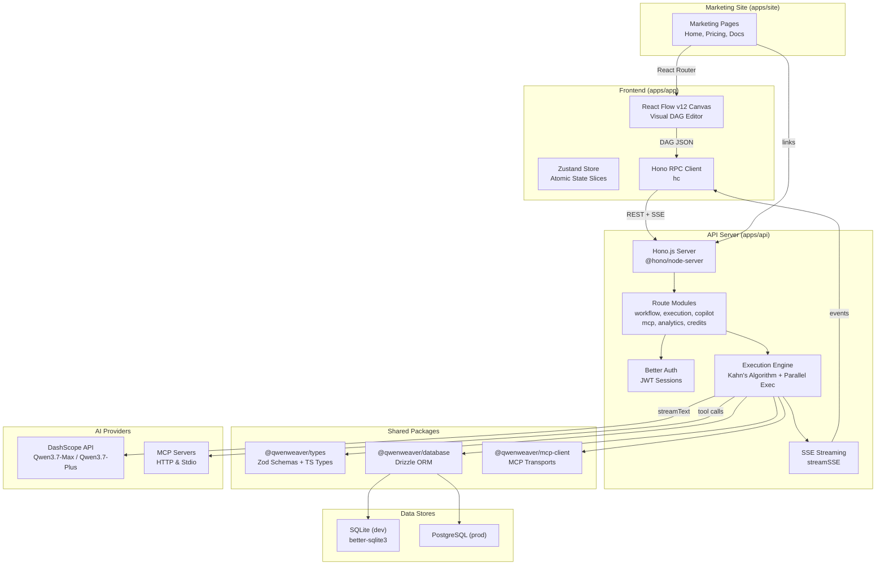

# QwenWeaver Architecture

QwenWeaver is a TypeScript-native, pnpm monorepo that combines a visual DAG editor (React Flow v12) with a parallel execution engine (Hono.js) and Qwen AI models (DashScope) to orchestrate multi-agent workflows.

The platform is split into three application layers plus shared packages:

- **apps/app** — The main SPA: a React Flow v12 canvas where users visually build agent workflows as directed acyclic graphs (DAGs). State is managed via Zustand with atomic slices for graph, execution, auth, and more. The frontend communicates with the API via Hono's RPC client for REST calls and consumes Server-Sent Events (SSE) for real-time execution streaming.
- **apps/api** — The Hono.js backend: receives DAG JSON, compiles it into topological batches using Kahn's Algorithm, and executes agents in parallel with `Promise.all`. Results stream back via SSE as token chunks, status updates, and edge activations. Also handles auth (Better Auth), MCP tool integration, media generation (image/audio/video via DashScope), and cloud credits/billing.
- **apps/site** — The marketing site: landing page, pricing, and documentation.

The three apps share common packages: `@qwenweaver/types` (Zod schemas), `@qwenweaver/database` (Drizzle ORM, dual dialect), and `@qwenweaver/mcp-client` (MCP transport layer).

---

## High-Level Architecture



### Flow of Execution

1. A user builds a workflow on the canvas by dragging nodes (Agent, Supervisor, Trigger, MCP Tool, etc.) and connecting them with edges.
2. Clicking **Run** serializes the DAG as JSON and sends it to `POST /api/workflow/execute` via the Hono RPC client.
3. The engine compiles the DAG into topological batches using Kahn's Algorithm — nodes with no remaining dependencies within a batch execute concurrently via `Promise.all`.
4. During execution, the engine streams events back through SSE: `token` (LLM output chunks), `status_update` (node state changes), `edge_active` (data flow between nodes), `workspace_write`, `bus_message`, and `debate_round`.
5. The Zustand store intercepts these events, triggering node glow effects, edge animations, and live output rendering on the canvas.
6. If a Supervisor node detects issues, it emits `[REJECT]` with feedback, and the engine backtracks to re-execute the upstream agent — up to a configurable number of rounds.

---

## Key Components

### Execution Engine (`apps/api/src/engine/`)

| Component       | File                 | Role                                                                        |
| --------------- | -------------------- | --------------------------------------------------------------------------- |
| DAG Compiler    | `dag-compiler.ts`    | Kahn's Algorithm — topological sort, cycle detection, batch grouping        |
| Executor        | `executor.ts`        | Main loop — iterates batches, handles supervisor backtracking               |
| Agent Runner    | `agent-runner.ts`    | Invokes LLMs via `streamText`, manages tool calls and media generation      |
| Debate Runner   | `debate-runner.ts`   | Multi-agent debate rounds, optional AI arbitrator with scoring              |
| Message Bus     | `message-bus.ts`     | Topic-based pub/sub for inter-agent communication                           |
| Model Router    | `model-router.ts`    | Selects Qwen model per node type (qwen3.7-max, qwen3.7-plus, qwen3.6-flash) |
| MCP Bridge      | `mcp-bridge.ts`      | Discovers and executes MCP tools                                            |
| Workspace Tools | `workspace-tools.ts` | Shared blackboard — agents read/write/append collaboratively                |
| Generators      | `generators/`        | Media generation — Wanx (image, video), CosyVoice (audio)                   |

### Frontend State Management

The Zustand store is split into atomic slices to prevent unnecessary re-renders:

| Slice     | File                 | State                                           |
| --------- | -------------------- | ----------------------------------------------- |
| Graph     | `graph-slice.ts`     | nodes, edges, selected IDs                      |
| Execution | `execution-slice.ts` | execution ID, status, streaming tokens, metrics |
| Auth      | `auth-slice.ts`      | user, session, tokens                           |
| Copilot   | `copilot-slice.ts`   | chat history, pending graph proposals           |
| History   | `history-slice.ts`   | undo/redo stack                                 |
| Templates | `templates-slice.ts` | community gallery, fork state                   |

Components subscribe to specific slices using granular selectors (e.g., `useStore(s => s.nodes)`) rather than the full store, keeping re-renders minimal.

### Database Strategy

Drizzle ORM manages a dual-dialect schema:

- **SQLite** (`better-sqlite3`) — local development
- **PostgreSQL** — production (Supabase)

Both dialects share the same table structure but use dialect-specific types (INTEGER PKs for SQLite, UUID PKs for PostgreSQL). Migrations are additive-only — columns are never dropped or renamed.

Key tables: `users`, `workflows`, `executions`, `agent_logs`, `execution_messages`, `workspace_entries`, `mcp_servers`, `credentials`, `credits`.

---

## Project Structure

```
qwenweaver/
├── apps/
│   ├── app/                     # Main SPA (React 19 + Vite + React Flow v12)
│   │   └── src/
│   │       ├── store/           # Zustand atomic slices
│   │       ├── components/      # Custom nodes, edges, inspector, panels
│   │       ├── services/        # API service wrappers + SSE stream handler
│   │       ├── hooks/           # Auto-save, keyboard shortcuts
│   │       ├── lib/             # API client, example workflows, utilities
│   │       └── utils/           # DAG layout, validation, graph actions
│   │
│   ├── site/                    # Marketing site (Vite + React + Tailwind v4)
│   │   └── src/
│   │       ├── pages/           # Home, Pricing
│   │       ├── docs/            # Documentation pages
│   │       └── components/      # Shared site components
│   │
│   └── api/                     # Hono.js backend
│       └── src/
│           ├── engine/          # Core execution engine
│           ├── routes/          # API route modules
│           ├── middleware/      # Rate limiter
│           ├── auth.ts          # Better Auth integration
│           ├── logger.ts        # Pino structured logging
│           ├── metrics.ts       # Prometheus metrics
│           └── config.ts        # Environment configuration
│
├── packages/
│   ├── types/                   # Shared Zod schemas + TypeScript interfaces
│   ├── database/                # Drizzle ORM — dual dialect (SQLite / PostgreSQL)
│   └── mcp-client/              # MCP transport layer (HTTP & Stdio)
│
└── ...config files
```

---

## Node Types

| Node          | Type            | Description                                    | Default Model |
| ------------- | --------------- | ---------------------------------------------- | ------------- |
| Trigger       | `trigger`       | Entry point, passthrough                       | qwen3.6-flash |
| Input Trigger | `input_trigger` | Entry point with input validation              | qwen3.6-flash |
| Agent         | `agent`         | LLM-powered with system prompt                 | qwen3.7-plus  |
| Supervisor    | `supervisor`    | Quality gate — reviews and can reject outputs  | qwen3.7-max   |
| Debate Arena  | `debate_arena`  | Multi-agent debate with optional AI arbitrator | qwen3.7-max   |
| MCP Tool      | `mcp_tool`      | Connects to external MCP server tools          | qwen3.7-plus  |
| Logic         | `logic`         | Routing, merging, conditional branching        | qwen3.6-flash |

---

## MCP Tool Integration

Agents can connect to external tools via the Model Context Protocol. The `@qwenweaver/mcp-client` package supports two transport modes:

- **HTTP Streamable** — remote MCP servers over HTTP
- **Stdio** — local processes (e.g., npx-based servers)

Tools are discovered on execution via `listTools()` and injected into the agent's prompt. Auth methods include `none`, `api_key` (header), `bearer` (token), and `basic` (username+password). Credentials are encrypted at rest in the `credentials` table and resolved at runtime via the credential resolver.

---

## Agent Disagreement and Conflict Resolution

To meet the requirements of Track 3 (Agent Society), QwenWeaver implements three key architectural patterns for managing agent disagreements, execution conflicts, and collaborative shared memory state:

### 1. Supervisor Backtracking (Sequential Quality Gates)

When a `supervisor` node reviews upstream outputs and encounters issues, it outputs a `[REJECT]` prefix along with constructive natural-language feedback. The execution engine:

- Traps the rejection during batch execution.
- Identifies all upstream nodes that contributed inputs to the supervisor.
- Wipes their published outputs from the active `DataBus`.
- Appends the supervisor's feedback to the upstream agents' cumulative revision history.
- Rewinds Kahn's execution queue (backtracks) to re-run the upstream agents with the new feedback context.
- Runs this feedback loop up to a user-configured limit (default: 3 rounds).

### 2. Debate Arena (Democratic Consensus)

For complex multi-agent negotiations, the `debate_arena` node groups multiple worker agents in a structured, multi-turn exchange:

- **Modes**: Supports `debate` (arguing distinct positions), `negotiation` (compromising on overlap), and `consensus` (collaborative alignment).
- **Rounds**: Workers generate parallel statements and rebuttals, referencing the shared discussion transcript in subsequent turns.
- **Impartial Arbitration**: An optional AI arbitrator (`qwen3.7-max` with reasoning/thinking enabled) evaluates the transcript, scores each participant based on custom criteria, and produces a final consolidated verdict.

### 3. Shared Workspace Concurrency Control

When multiple agents in a parallel batch write to the shared blackboard, data race conditions can occur. QwenWeaver mitigates this using optimistic concurrency control:

- The `workspace_append` tool reads the entry, tracks its current revision round, appends the new data, and attempts to write it back.
- If a write conflict is detected (the round changed in the database due to a concurrent write by another agent), the tool rolls back, waits with exponential backoff, and retries up to 5 times.
