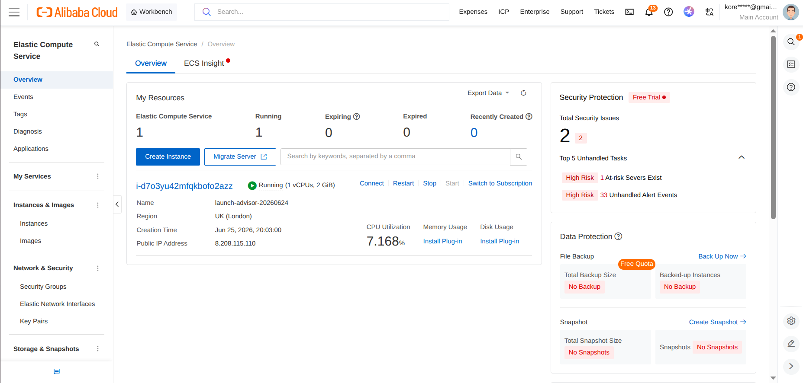
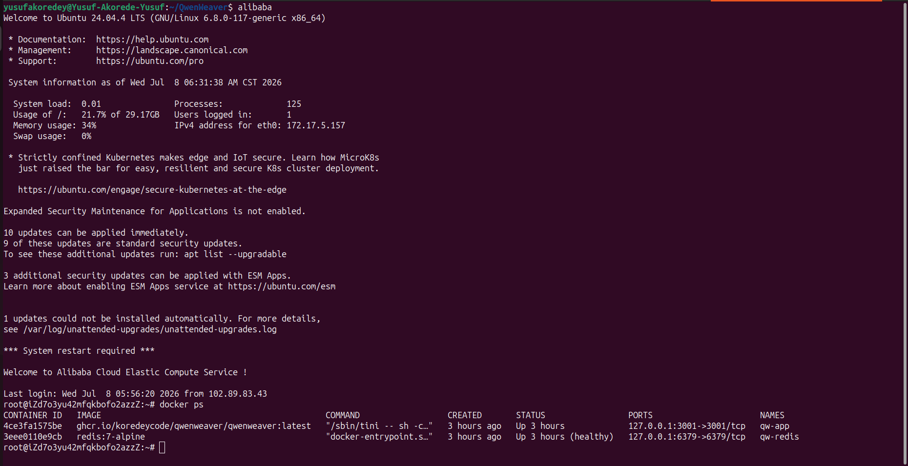
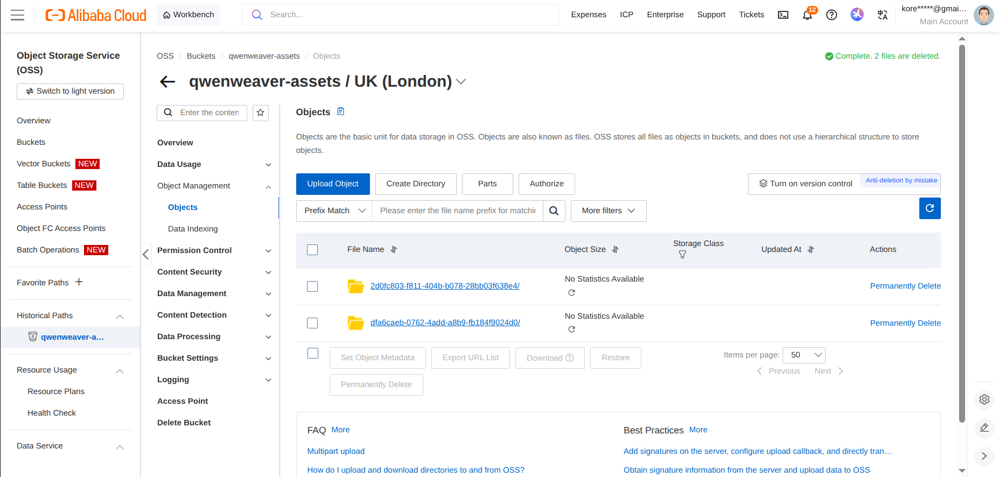
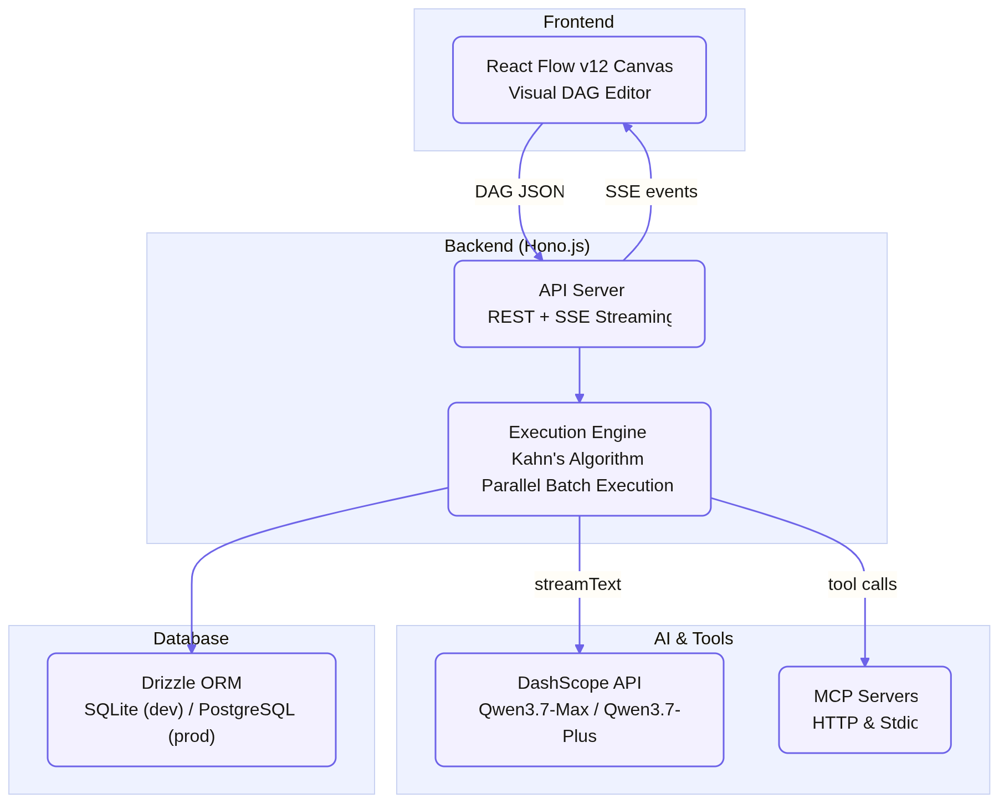

# Proof of Alibaba Cloud Deployment

> **Single source of truth for QwenWeaver's Alibaba Cloud integration.**
> This document links every code file that uses Alibaba Cloud services and APIs, plus screenshots proving the backend runs on Alibaba Cloud infrastructure.

**Live deployment:** [app.qwenweaver.xyz](https://app.qwenweaver.xyz) — backend hosted on an Alibaba Cloud ECS instance, assets on Alibaba Cloud OSS, all AI inference via Qwen models on DashScope (Model Studio).

---

## 1. Deployment Screenshots

### Alibaba Cloud ECS (Elastic Compute Service) — backend host

The QwenWeaver API (Hono.js + execution engine) runs in Docker on an Alibaba Cloud ECS instance (IP `8.208.115.110`, behind `app.qwenweaver.xyz`).

### Alibaba Cloud OSS (Object Storage Service) — asset storage

All generated workflow artifacts (agent outputs, generated images, audio, video) are stored in a private Alibaba Cloud OSS bucket and served through a signed-URL proxy.

---

## 2. Alibaba Cloud Code Files

### Qwen LLM Inference (DashScope via `@ai-sdk/alibaba`)

| File                                                                                    | What it does                                                                                                                                                                                                                                                                     |
| --------------------------------------------------------------------------------------- | -------------------------------------------------------------------------------------------------------------------------------------------------------------------------------------------------------------------------------------------------------------------------------- |
| [`apps/api/src/engine/model-router.ts`](../apps/api/src/engine/model-router.ts)         | Initializes the Alibaba provider (`createAlibaba` with `DASHSCOPE_API_KEY` / `DASHSCOPE_BASE_URL`) and routes each node type to its Qwen model: `qwen3.7-max` (supervisors/arbitrators, with thinking mode), `qwen3.7-plus` (agents/MCP tools), `qwen3.6-flash` (triggers/logic) |
| [`apps/api/src/engine/agent-runner.ts`](../apps/api/src/engine/agent-runner.ts)         | Streams Qwen completions with `enableThinking` + `thinkingBudget` provider options, tool calling (MCP + workspace blackboard), and token accounting                                                                                                                              |
| [`apps/api/src/engine/debate-runner.ts`](../apps/api/src/engine/debate-runner.ts)       | Multi-agent debate/negotiation/consensus rounds with a `qwen3.7-max` reasoning arbitrator                                                                                                                                                                                        |
| [`apps/api/src/engine/prompt-extractor.ts`](../apps/api/src/engine/prompt-extractor.ts) | Uses Qwen to extract clean media-generation prompts from upstream agent outputs                                                                                                                                                                                                  |
| [`apps/api/src/config.ts`](../apps/api/src/config.ts)                                   | DashScope + OSS credential/endpoint configuration                                                                                                                                                                                                                                |

### DashScope Media Generation Pipelines

| File                                                                                                          | Alibaba Cloud API                |
| ------------------------------------------------------------------------------------------------------------- | -------------------------------- |
| [`apps/api/src/engine/generators/qwen-image.ts`](../apps/api/src/engine/generators/qwen-image.ts)             | Qwen Image Pro (text-to-image)   |
| [`apps/api/src/engine/generators/wanx-image.ts`](../apps/api/src/engine/generators/wanx-image.ts)             | Wanx text-to-image               |
| [`apps/api/src/engine/generators/wanx-video.ts`](../apps/api/src/engine/generators/wanx-video.ts)             | Wanx text-to-video               |
| [`apps/api/src/engine/generators/happyhorse-video.ts`](../apps/api/src/engine/generators/happyhorse-video.ts) | HappyHorse text-to-video         |
| [`apps/api/src/engine/generators/happyhorse-i2v.ts`](../apps/api/src/engine/generators/happyhorse-i2v.ts)     | HappyHorse image-to-video        |
| [`apps/api/src/engine/generators/cosyvoice.ts`](../apps/api/src/engine/generators/cosyvoice.ts)               | CosyVoice speech synthesis (TTS) |

### Alibaba Cloud OSS Storage

| File                                                                              | What it does                                                                                                   |
| --------------------------------------------------------------------------------- | -------------------------------------------------------------------------------------------------------------- |
| [`apps/api/src/storage/oss.ts`](../apps/api/src/storage/oss.ts)                   | OSS storage driver (`ali-oss` SDK, V4 request signing) — writes all workflow artifacts to a private OSS bucket |
| [`apps/api/src/routes/storage/index.ts`](../apps/api/src/routes/storage/index.ts) | Signed-URL proxy endpoint for secure private-bucket access from the frontend                                   |

### Deployment Infrastructure

| File                                                              | What it does                                                                                                                             |
| ----------------------------------------------------------------- | ---------------------------------------------------------------------------------------------------------------------------------------- |
| [`Dockerfile`](../Dockerfile)                                     | Multi-stage Docker build deployed to the ECS instance                                                                                    |
| [`docker-compose.prod.yml`](../docker-compose.prod.yml)           | Production container orchestration on ECS (API + Redis)                                                                                  |
| [`.github/workflows/deploy.yml`](../.github/workflows/deploy.yml) | CI/CD pipeline: builds the image, pushes to GHCR, SSHes into the Alibaba Cloud ECS instance, and restarts containers with a health check |

---

## 3. Architecture

See [ARCHITECTURE.md](./ARCHITECTURE.md) for the full system documentation.
